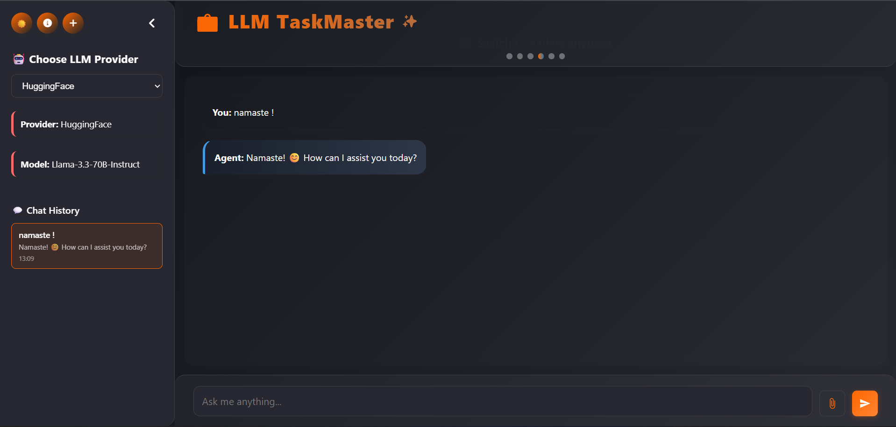
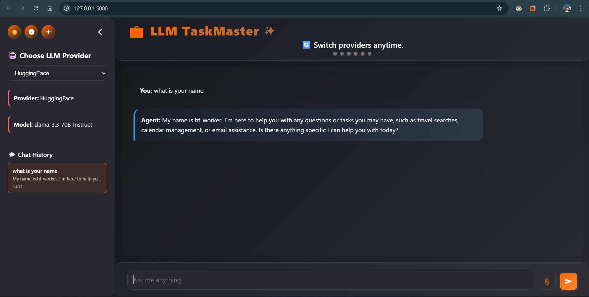
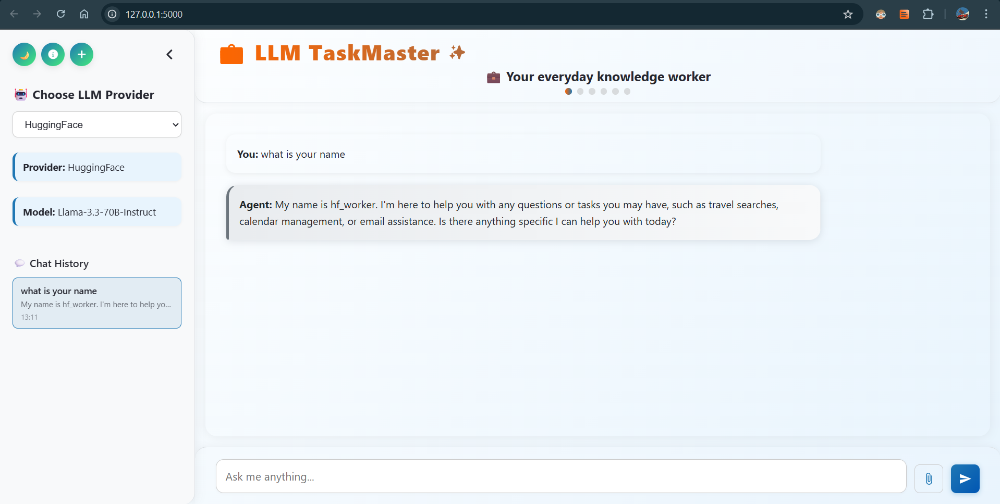
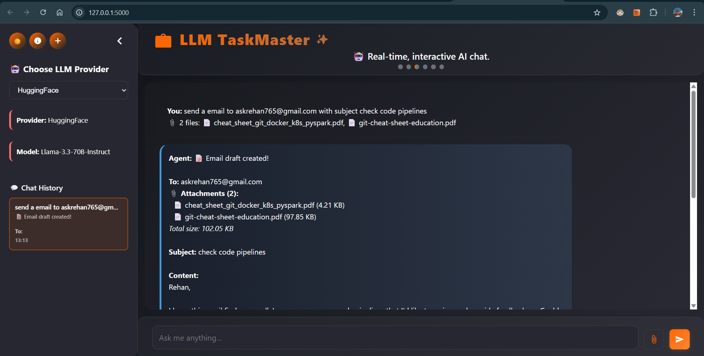
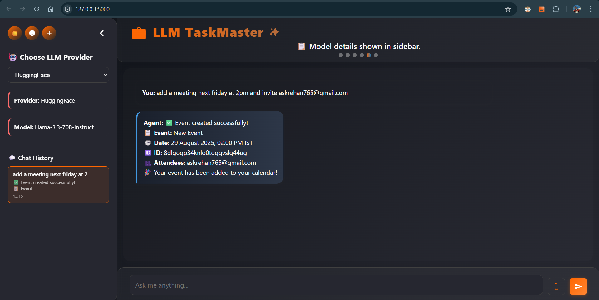
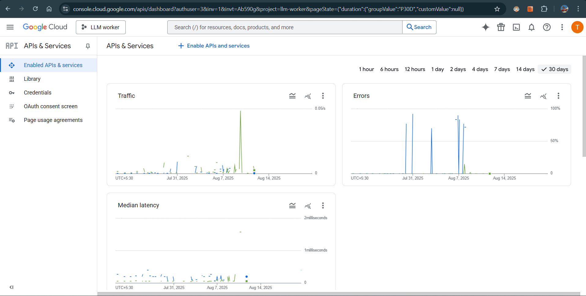

# 💼 LLM Knowledge Worker

A modern AI productivity assistant that brings together Large Language Models (LLMs), Gmail, Google Calendar, and travel APIs into a single, beautiful web app. Automate your emails, calendar, travel search, and more—just by chatting!

---

## ✨ Features

<div align="center">
  
</div>

- **🤖 Multi-LLM Support:** Switch between Groq and HuggingFace models for chat and automation.
- **📧 Email Automation:** Read, compose, reply, edit, and send emails via Gmail API.
- **📅 Calendar Integration:** Create, list, and delete Google Calendar events; view holidays.
- **✈️ Travel Search:** Find flights using Google Flights via RapidAPI.
- **🧠 Memory Store:** Semantic memory using Qdrant and Sentence Transformers.
- **📎 File Attachments:** Attach files to emails with drag-and-drop support.
- **🌗 Dark/Light Mode:** Toggle between themes for comfortable viewing.
- **🕒 Chat History:** Persistent chat history and context management.
- **🗣️ Natural Language Understanding:** Smart parsing of user requests for emails, calendar, and travel.

---

## 🖼️ Screenshots

| Dark Mode | Light Mode | Attachments | Calendar |
|-----------|------------|-------------|----------|
|  |  |  |  |

---

## 📝 Setup Instructions

### 1. Clone the Repository

```sh
git clone https://github.com/yourusername/llm-knowledge-worker.git
cd llm-knowledge-worker
```

### 2. Install Dependencies

```sh
python -m venv venv
source venv/bin/activate  # On Windows: venv\Scripts\activate
pip install -r requirements.txt
```

### 3. Environment Variables

Copy `.env.example` to `.env` and fill your API keys:

- **GROQ_API_KEY**: Get from [Groq](https://groq.com/)
- **HF_TOKEN**: Get from [HuggingFace](https://huggingface.co/settings/tokens)
- **QDRANT_API_KEY** and **QDRANT_URL**: Get from [Qdrant Cloud](https://cloud.qdrant.io/)
- **RAPIDAPI_KEY**: Get from [RapidAPI](https://rapidapi.com/)
- **FLASK_SECRET_KEY**: Generate a random string

### 4. Google OAuth 2.0 Setup

<div align="center">
  
</div>

#### a. Create a Google Cloud Project

- Go to [Google Cloud Console](https://console.cloud.google.com/)
- Create a new project.

#### b. Enable Gmail & Calendar APIs

- In your project, go to **APIs & Services > Library**
- Enable **Gmail API** and **Google Calendar API**

#### c. Configure OAuth Consent Screen

- Go to **APIs & Services > OAuth consent screen**
- Set up the consent screen (choose External or Internal as needed).

#### d. Create OAuth Credentials

- Go to **APIs & Services > Credentials**
- Click **Create Credentials > OAuth client ID**
- Choose **Desktop App** (for local testing) or **Web Application** (for deployment)
- Download `credentials.json` and place it in the `credentials/` folder.

#### e. Generate `token.json`

- On first run, the app will prompt you to authenticate with Google.
- Follow the link, sign in, and paste the code to generate `token.json`.

### 5. Run the App

```sh
python flaskapp.py
```

Visit [http://localhost:5000](http://localhost:5000) in your browser.

---

## 🛠️ Project Structure

```
llm-knowledge-worker/
├── flaskapp.py
├── main.py
├── modules/
│   ├── agent_orchestrator.py
│   ├── groq.py
│   ├── hf_agent.py
│   ├── email_module.py
│   ├── calendar_module.py
│   ├── travel_module.py
│   └── memory_module.py
├── templates/
│   └── index2.html
├── requirements.txt
├── .env
└── credentials/
    └── credentials.json
```

---

## 💡 Usage

<div align="center">
  
</div>

- **Chat with LLMs:** Type your requests (e.g., "Send email to alice@example.com", "Show my calendar", "Find flights from Mumbai to Tokyo tomorrow").
- **Switch Providers:** Use the sidebar to select Groq or HuggingFace.
- **Attach Files:** Drag and drop files to attach to emails.
- **Toggle Theme:** Switch between dark and light mode.

---

## 🔒 Security Notes

- Keep your `.env` and `credentials/` files secure.
- Never commit sensitive keys to public repositories.

---

## 📄 License

MIT License

---

<div align="center">
  
  <br>
  <b>Contributions welcome!</b> Please open issues or submit pull requests for